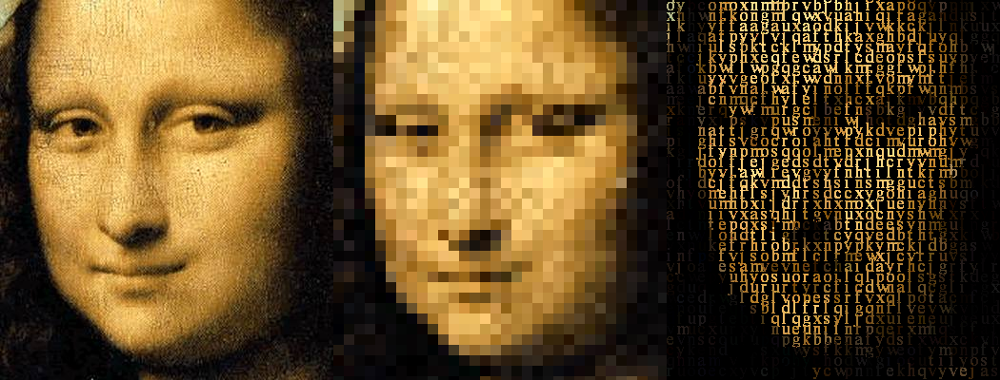

imageAsciifier
==============

Simple processing sketch to 'asciify' images. Written almost 3 years ago.

## Usage

Place your desired image into the data folder and rename it as `input.jpg` then run the sketch. `block_size` variable defines the size of each char block. Decrease this in order to get a higher resolution output.

## Example

###Takes this:

###Then, converts into this:

